# GitとGitHubの基本　<!-- omit in toc -->
# 非プログラマ、科学計算にRを使う人向けのチュートリアル　<!-- omit in toc -->

## 目次　<!-- omit in toc -->
- [§0 イントロダクション](#0-イントロダクション)
  - [§0-1 このチュートリアルについて](#0-1-このチュートリアルについて)
  - [§0-2 バージョン管理とは](#0-2-バージョン管理とは)
  - [§0-3 どうして学ぶ必要があるのか](#0-3-どうして学ぶ必要があるのか)
  - [§0-4 参考にしたサイトなど](#0-4-参考にしたサイトなど)
- [§1 準備](#1-準備)
  - [§1-1 Githubアカウントの作成](#1-1-githubアカウントの作成)
  - [§1-2 RとRStudioのインストール or アップデート](#1-2-rとrstudioのインストール-or-アップデート)
  - [§1-3 Gitがすでにインストールされているかチェック](#1-3-gitがすでにインストールされているかチェック)
  - [§1-4 Gitが入っていなかった場合](#1-4-gitが入っていなかった場合)
  - [§1-5 Gitとgithubを繋げる。](#1-5-gitとgithubを繋げる)
  - [§1-6 gitクライアントについて (オプション)](#1-6-gitクライアントについて-オプション)
  - [§1-7 SSHキーの設定](#1-7-sshキーの設定)
    - [SSHキーをもっているかを確認する。](#sshキーをもっているかを確認する)
    - [SSHキーを作成する。](#sshキーを作成する)
    - [SSH-agentが有効かどうかを確認する。](#ssh-agentが有効かどうかを確認する)
    - [SSHキーを GitHubに登録する。](#sshキーを-githubに登録する)
- [§2 個人開発編](#2-個人開発編)
  - [§2-1 初めてGitHubでレポジトリを作ってRStudioで使ってみる。](#2-1-初めてgithubでレポジトリを作ってrstudioで使ってみる)
    - [Githubでリポジトリを作る。](#githubでリポジトリを作る)
    - [RStudioでリポジトリをローカル (PC上) にクローン (コピー) する。](#rstudioでリポジトリをローカル-pc上-にクローン-コピー-する)
    - [ローカルでファイルを変更してコミットしてプッシュする。](#ローカルでファイルを変更してコミットしてプッシュする)
      - [README.mdファイルの作成](#readmemdファイルの作成)
      - [ここからの流れの説明](#ここからの流れの説明)
      - [変更点をステージに送る。](#変更点をステージに送る)
      - [コミットする。](#コミットする)
      - [変更点をプッシュする。](#変更点をプッシュする)
  - [§2-2 日常的な作業をしてみる。 (Pull, Commit, Push)](#2-2-日常的な作業をしてみる-pull-commit-push)
    - [まずはプル](#まずはプル)
    - [次に編集してコミット](#次に編集してコミット)
    - [最後にプッシュ](#最後にプッシュ)
  - [§2-3 RStudio特有の問題　.gitignoreによる追跡の除外](#2-3-rstudio特有の問題gitignoreによる追跡の除外)
  - [§2-4 初めてのブランチ 家とラボの両方でコードを書く](#2-4-初めてのブランチ-家とラボの両方でコードを書く)
  - [§2-5 コンフリクトに対応してみる。](#2-5-コンフリクトに対応してみる)
  - [§2-5 VSCodeをGitHubと連携してみる。](#2-5-vscodeをgithubと連携してみる)
- [§3 共同開発編](#3-共同開発編)
  - [§3-1](#3-1)
- [Appendix1 パスとディレクトリ](#appendix1-パスとディレクトリ)
  - [パスとディレクトリ](#パスとディレクトリ)
  - [絶対パスと相対パス](#絶対パスと相対パス)
  - [「いる」とは何か](#いるとは何か)
  - [ホームディレクトリとルートディレクトリ](#ホームディレクトリとルートディレクトリ)
- [Appendix2 そもそもGitとGithubとは？](#appendix2-そもそもgitとgithubとは)
- [Appendix3 Markdown　　](#appendix3-markdown)
  - [基本的な記法](#基本的な記法)
    - [見出し](#見出し)
    - [太字](#太字)
    - [斜体](#斜体)
    - [箇条書き](#箇条書き)
    - [番号付きリスト](#番号付きリスト)
    - [リンク](#リンク)
    - [画像](#画像)
  - [Markdownのメリット](#markdownのメリット)
  - [Markdownのデメリット](#markdownのデメリット)
  - [まとめ](#まとめ)

<div style="page-break-before:always"></div>


# §0 イントロダクション
## §0-1 このチュートリアルについて
このチュートリアルは、プログラマではないけれど科学計算のためにRを使う人に向けた、GitとGitHubの基本的な使い方の解説です。  
GitとGitHubは、ソフトウェア開発だけでなく、データ分析や研究の分野でも非常に便利なツールです。  
このチュートリアルを通じて、GitとGitHubの基本的な概念や操作方法を学び、効率的なプロジェクト管理や共同作業ができるようになることを目指します。

このチュートリアルは大きく3つに分かれています。
- 準備編  
- 個人開発編  
- 共同開発編  　　

最初の準備編ではGitやGitHubを使う準備をします。ここはGitをどんな使い方で使うにしても大切な部分です。慣れていないと難しい部分も多いですが、頑張りましょう。

次の個人開発編は通常Git, Githubではあまり出てこない、「一人で」バージョン管理をする場合の使い方を学びます。Git等はシステム系で出てくることが多く、ネット上の情報も多くは情報系の人が書いています。そういう人たちの作るプログラムは基本的に多人数で共同して作成しており、成果物自体がアプリ等の形で世に出ることが多いです。一方で非プログラマで科学研究にGitを用いる私たちの場合、解析プログラムは世界中を見渡しても多くて数人、なんなら自分しか使わないことが多々あります。これは研究テーマ自体の独自性に寄与しているので割と皆さんそうなのではないかと思います。また機密性の観点から、共有できる範囲が広くて共同研究者レベルまでということもあり、そもそも共同開発になりにくいです。Gitは共同開発だけではなくて、個人開発にも大変便利ですので、2番目の章では個人開発のためのGitの使い方を学びます。gitを少し触ったことのある人に言うなら、Pull requestやForkといった概念はここでは出てきません。ブランチは少し出てきますが、なくても良いかもしれません。

最後の共同開発編は、複数人で解析プログラムを作成する場合の使い方です。具体的にはPythonの解析用の基本コードやRの図表作成用コードは共有してもいいのかなと思っております。またここを勉強すると世界中のラボで作られたコードを使ったり改良したりといった作業ができるようになります。ただ前述の通り、生物系では必須ではないかもしれません。

## §0-2 バージョン管理とは   
みなさんはwordファイルに 「report_20240630.docx」や「report_latest.docx」といったような名前をつけたことがあるでしょうか？  
もしあるなら、みなさんはすでにバージョン管理をしたことがあると言うことです。  
バージョン管理はまさに先ほどのように、テキストやスクリプトを更新するたびに新しいバージョンを作成し、変更点を追跡するプロセスです。  

先ほどのファイル名を変更してバージョン管理をする　と言うのも一つの手です。  
ただしみなさんも体感したことがあるかもしれませんが、この方法だとどれが最新版か分からなかったり、どういう変更を加えたのか分からなくなることがあります。

GitやGitHubはこれらの問題を解決してくれるツールと考えれば良いと思います。

## §0-3 どうして学ぶ必要があるのか

一般に研究室において、データの管理は厳しく言われることが多いと思います。一方で解析するコードを自分で書いたりした場合にはあまり厳しく管理について言われることはないのではないでしょうか。コードを本気で (手動で)　管理したいなら毎回解析に使用したソースコードをノートに貼り付ければ良いと思いますが、そんなことをしている人は見たことがありません。

情報系等ではソースコードはGitで管理することが多いようです。Git管理すれば、「あの時のコード」がどんなコードであって、その後どんな変更を加えられたのかを全て記録することができます。これによって、「あの時のコードであればうまく解析できたのに」と涙を飲む回数を減らせるはずです。

またもう一つの大きな点として、コードシェアが求められることが多くなってきていることがあります。適当な論文で"github"と検索してみるとわかると思いますが、最近は生物系の論文でも解析コードをGithubでシェアしていることが多いです。これは再現性の担保の観点から必要とされているからでしょう。生データとコードがシェアされていれば、データ解析の部分で変なことが起こっていないかを世界中で検証可能です。実際に、生物系のジャーナルで論文投稿した際に「解析に使ったコードはGithubなどでシェアしてくださいね」という要請が来た例が身近にありました。このような必要性の観点からもGithubを勉強することは大事だと思います。

## §0-4 参考にしたサイトなど
https://happygitwithr.com

<div style="page-break-before:always"></div>

# §1 準備      
それでは必要なソフトなどをインストールしていきます。ここが一番大変なところです。   

## §1-1 Githubアカウントの作成  
https://github.com. 
こちらからアカウントを作成します。日本語の記事ではこちら. 
https://reffect.co.jp/html/create_github_account_first_time. 
がわかりやすいと思います。  
注意点としては、アカウント名は比較的いろんなことに使うので、恥ずかしくなくて長過ぎないものにしておきましょう。  
メールアドレスとユーザー名はすぐに使うので覚えておきましょう。  

## §1-2 RとRStudioのインストール or アップデート
1. Rをインストール. 
ここか、ミラーサイトからどうぞ    
https://cloud.r-project.org    

もしすでにRをインストールしているなら、スキップで大丈夫ですが、良い機会なのでRが最新版か確認して、必要ならアップデートしておくと良いでしょう。

2. RStudioのインストール
ここからどうぞ    
https://www.rstudio.com/products/rstudio/download/preview/

こちらももしもうインストールしているなら、スッキプ可能です。アップデートは必要ならしてください。  

## §1-3 Gitがすでにインストールされているかチェック 
最初にすでにgitがインストールされていないかチェックします。  
ターミナル (windownsの場合にはコマンドプロンプト) を開きます。  

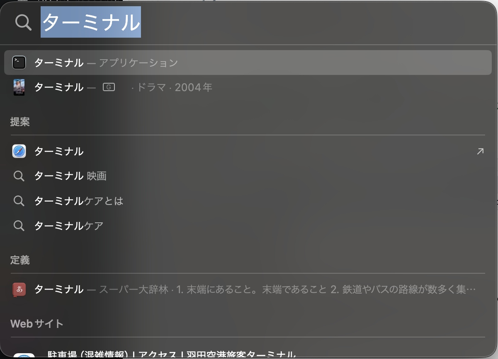 

以下を実行します。
Macの場合
```bash
which git
```
Windowsの場合
```bash
where git
```
(linuxの人はそもそもこの辺りでつまらないと思うので、省略)
これを入れてもし以下のような返答が返ってきているなら、すでにgitが入っています。
```
/usr/bim/git
```

ついでにバージョンをチェックしてみましょう。
```bash
git --version
## git version 2.45.2
```
こんな感じで返ってくればOK

## §1-4 Gitが入っていなかった場合
インストールしてください。
こちらからどうぞ
https://git-scm.com/downloads

## §1-5 Gitとgithubを繋げる。
以下をmacの場合ターミナル、windownsの場合Git Bashで実行します。
GitBashは以下のように探すといいと思います。  

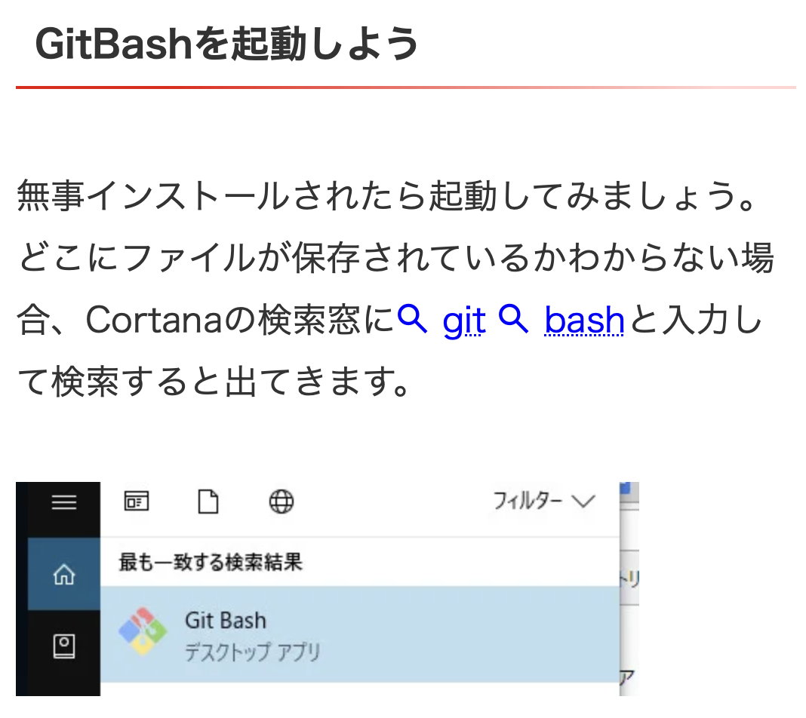   

Your name と Your addressを自分のものに変えてください。

```
git config --global user.name "Your name"
git config --global user.email "Your address"
git config --global --list
```
これで作ったGithubアカウントとあなたのPCのGitを繋げることができます。  

## §1-6 gitクライアントについて (オプション)
(最初は飛ばしてOK)
GitやGitBashは便利ですが、見た目がいかつくて難しいです。文字がたくさん出てきて真っ黒の画面を見るのが好きならそのまま使えばいいと思います。  

僕を含めて、プログラマじゃない人にはもっと画像が出てきた方が良いと思います。
そのためにあるのがGitクライアントです。GitとGitクラインアントの関係は簡単にいうならRとRStudioの関係にちかいと思います。RStudioは直感的に動かしやすいですが、裏で動いているのはRです。Rを直接動かすのは難しいと思います。そんな感じで、Gitを直感的に動かせるのがGit クライアントです。

とここまで書くと使った方が良さそうですが、正直RStudioやVisual studio codeの機能で同様のことができるので、無理に使わなくて良いと思います。
興味のある方はSourceTreeやGithub Desktopを調べてみてください。  

## §1-7 SSHキーの設定
(ここはめちゃくちゃ難しいです。頑張りましょう。)  
SSHキーはGitとGithubが安全に通信するためのパスワードみたいなものと理解すれば良いと思います。公開するSSHキーを作成してPCに保存し、同様のものをGithubにも教えておくことで、認証を行います。
以下の画像がわかりやすいかもしれません。   

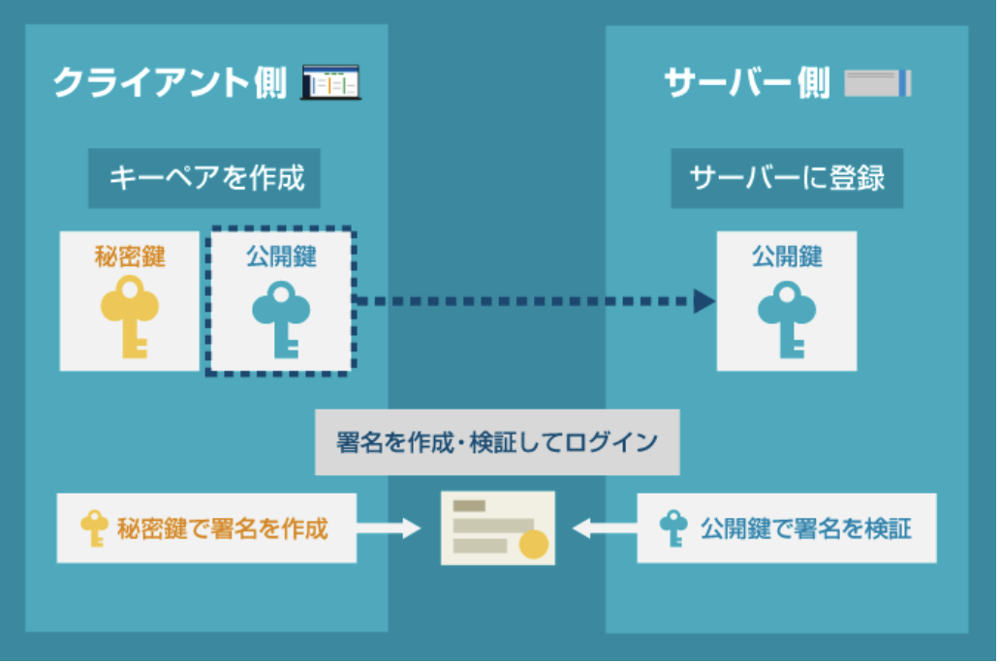   

### SSHキーをもっているかを確認する。
もしかしたらどこかでSSHキーをすでに作成しているかもしれません。そこで確認をしてみます。
Macの方はターミナル、windowsの方はGitBashに移動して以下のコードを実行します。
```Bash
ls -al ~/.ssh/
```
これで存在しないと言われた場合にはキーを持っていません。ただ、仮に持っていたとしてもいい機会なので更新するといいかもしれません。

### SSHキーを作成する。
```bash
ssh-keygen -t rsa
```
この後に色々と出てきますが、全部エンターで大丈夫です。最初に聞かれるのはSSHキーのファイル名、2番目と3番目はSSHキーにかけるパスワードですが、慣れないうちはパスワードをかけなくてもいいと思います。

こうすると、ホームディレクトリ [^1] 下に.sshというフォルダ [^2] が作成され、その中にid_rsaとid_rsa.pubが生成されます。

[^1]: ホームディレクトリって？？ってなった人は [Appendix1 パスとディレクトリ](#appendix1-パスとディレクトリ) を参照してみましょう。
[^2]: 隠しフォルダになっているので、デフォルトの設定では見れないかもしれません。これを機にかくしフォルダを表示するように設定を変更することをお勧めします。


### SSH-agentが有効かどうかを確認する。
ssh-agentはさっき作ったSSHキーを使ってくれるソフトウェアと思っておけばいいです。キーを作ったものの、うまくそのキーを使ってくれないと接続ができないです。 

チェックのために、Macの人はターミナルで、windowsの人はGitBashで

```bash
eval "$(ssh-agent -s)"
```
と打ってみてください。
これで
```
Agent pid 11111
```
みたいなのが返ってくれば大丈夫です。
ダメな人でMacの方は
```bash
sudo -s -H
```
と打って (必要ならパスワードを打って) 再度eval~~を試してみてください。これはいわゆる"管理者権限で実行" みたいなやつです。作業が終わったら
```bash
exit
```
で通常権限に戻すのをお忘れなく。

上記でもダメな場合やWindowsでダメな場合には私の手には負えないのでGitHubの該当箇所を当たるのが良いと思います。
https://docs.github.com/en/authentication/connecting-to-github-with-ssh/generating-a-new-ssh-key-and-adding-it-to-the-ssh-agent

ここまでできたらssh-agentにキーを追加します。
以下を実行してください。
```bash
ssh-add ~/.ssh/id_rsa
```

Macの方でmacOS Sierra 10.12.2以降の方はもう一つやることがあります。
まずは以下を実行です
```bash
open ~/.ssh/config
```
これで
```
The file /Users/YOU/.ssh/config does not exist.
```
と返ってきた時には以下を実行してください。
```
touch ~/.ssh/config
```
再度以下を実行すると新しいウィンドウが開くと思います。
```bash
open ~/.ssh/config
```

そしたら以下を書き込んでください。
Host github.com
  AddKeysToAgent yes
  IdentityFile ~/.ssh/id_rsa

お疲れ様です。

### SSHキーを GitHubに登録する。
最後のステップはSSHキーをGitHubに登録するステップです。
1. まずはSSHキー (公開鍵) をコピーします。
.sshディレクトリ下にid_rsa.pubと言うファイルがあると思うので、こちらを適当なエディタで開きます。 (windowsだとメモ帳、macだとテキストエディタ？)
内容をコピーしたらGitHubのホームページに行きます。(クリップボードを更新しないように!)

2. Githubのホームページから以下のように移動します。
   1. 自分のアイコンをクリック    
   
   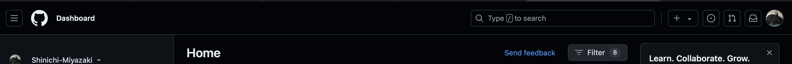   

   2. 設定をクリック      
   
   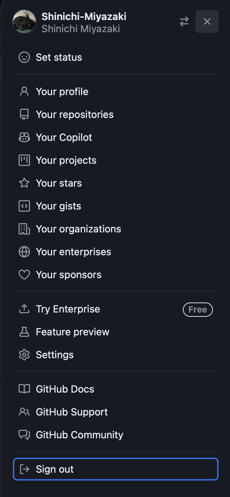    

   3. SSHをクリック      
   
   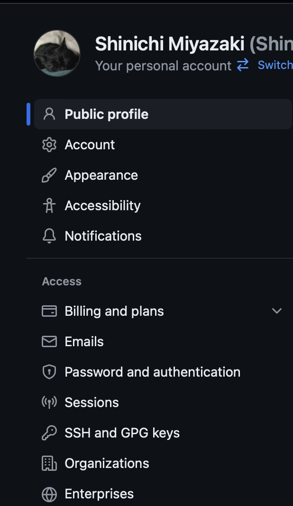     
   
   4. New SSH keyをクリック      
   
   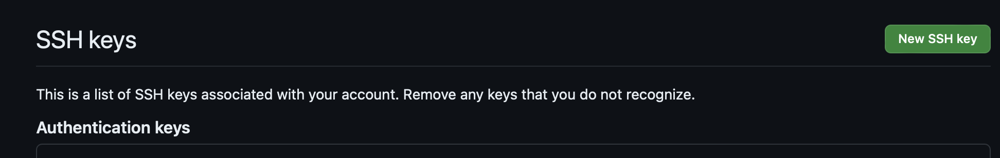       
   
   5. 適当なタイトル (大抵僕はPC名にしてます) をつけて、コピーしたキーを貼り付けてAdd    
   
   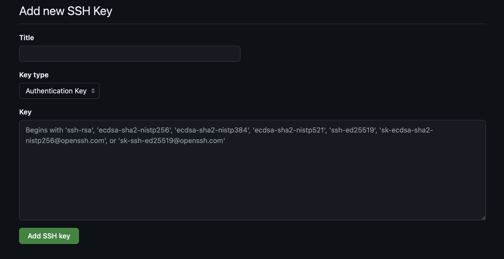     


これで完了です!  
ここまでくると、あなたのPCがSSHと言う安全な方法を使ってGithubとやりとりできるようになりました。

普通はこの後はコマンドライン (真っ黒の画面) でGitを使う話に入るんですが、私たちは生物系で真っ黒の画面にはアレルギーがあるのでスキップします。もちろん慣れてきたら真っ黒い画面で色々してみてください。

<div style="page-break-before:always"></div>

# §2 個人開発編 
## §2-1 初めてGitHubでレポジトリを作ってRStudioで使ってみる。
### Githubでリポジトリを作る。
それでは早速Githubでリポジトリを作ってみます。リポジトリというのは感覚としてはディレクトリやフォルダと似たように捉えれば良いと思います。
ここでいきなりわりかし重大な注意ですが、
**慣れるまでは最初にGithubでリポジトリを作る** 
というのを徹底した方がいいと思います。(特にRStudioユーザ)
リポジトリはローカル (みなさんのPC上) でも作れますが、RStudioではなぜかローカルで作ったリポジトリをGithubで共有する際に色々と詰まってしまいました。
自分だけならいいんですが、結局解決できなかったので、、、
あと参考にしたwebsiteもGitHubを最初に作るのを推奨しているので、、、
1. GitHubを開く    
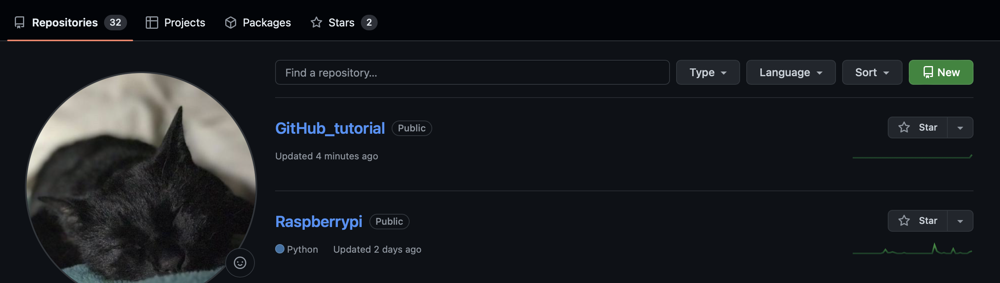     
1. レポジトリの設定    
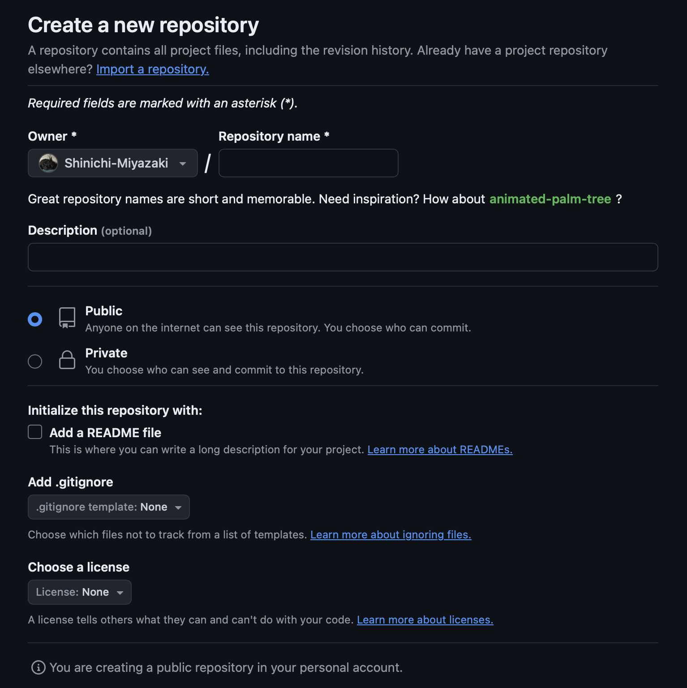   
ここでは設定をします。
- 名前: 適当に　でも覚えやすい名前にするといいです。これがPC上のディレクトリ名にもなるので長いと大変です。
- PrivateかPublicか: これは公開するかどうかです。研究関連で秘匿情報を含む可能性があるならPrivateが望ましいです。
- Add Readme: これはリポジトリの説明文を最初に追加しておくかどうかです。慣れないうちはなしでOK
- Add gitignore: これも最初は無視でOK
- Choose license: これも無視でOK
みたいな感じで設定したら、リポジトリが完成です。

### RStudioでリポジトリをローカル (PC上) にクローン (コピー) する。
今作ったリポジトリはGithub上 (リモート) に存在しています。こちらを手元のPCに持ってきましょう。
1. Githubでリポジトリを開く  
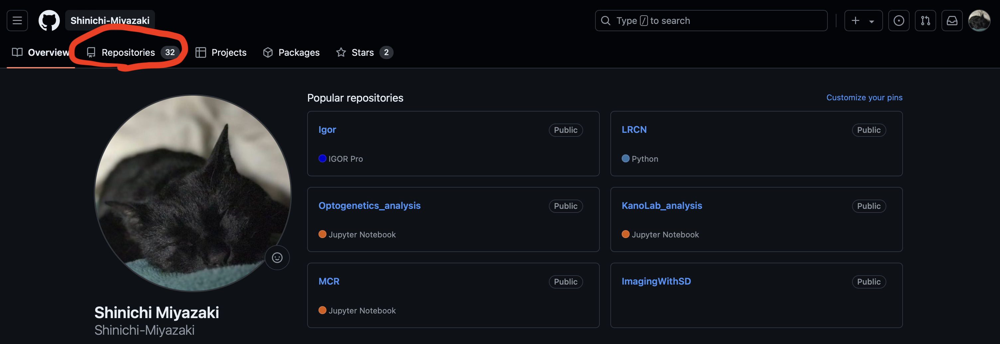   

2. リポジトリの右上の緑の部分を押す  
3. 下の画面が開くのでSSHの部分のクリップボードにコピーをおしてコピー  
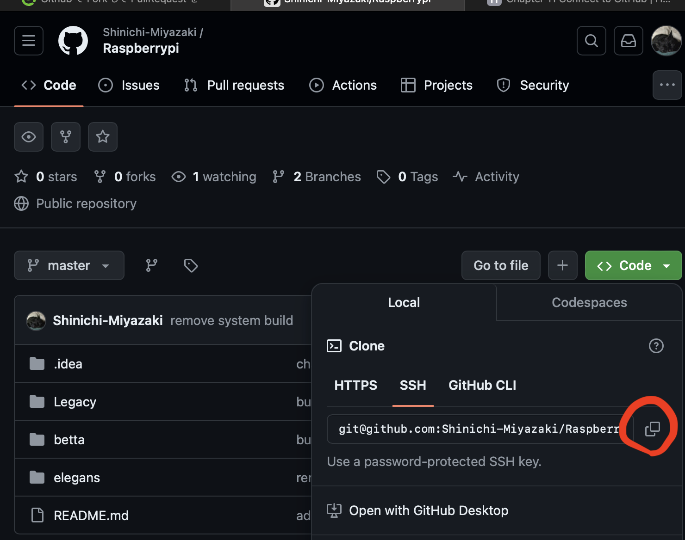     
4. RStudioを開く    
5. File/NewprojectからVersionControl/Gitを選択  
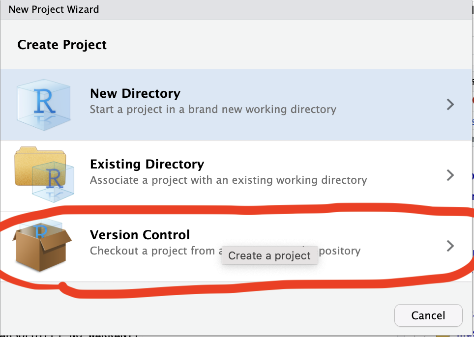    
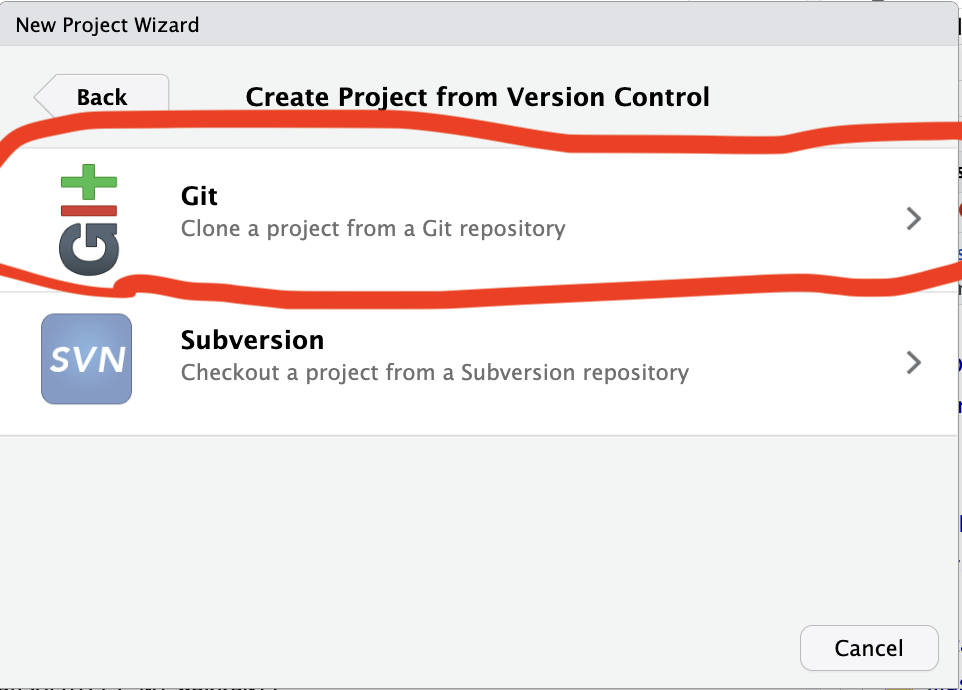   

6. Project URL にクリップボードの中身をペースト  
   
ここでどのフォルダに保存するかですが、ルート下にProjectsやrepos, githubとかの名前のディレクトリを作って、そこに保存していくといいと思います。  

7. 適当なフォルダ名をつけて保存
右上のPane (Environmentとかが入っているところ) に"Git"と表示されていれば成功です。  
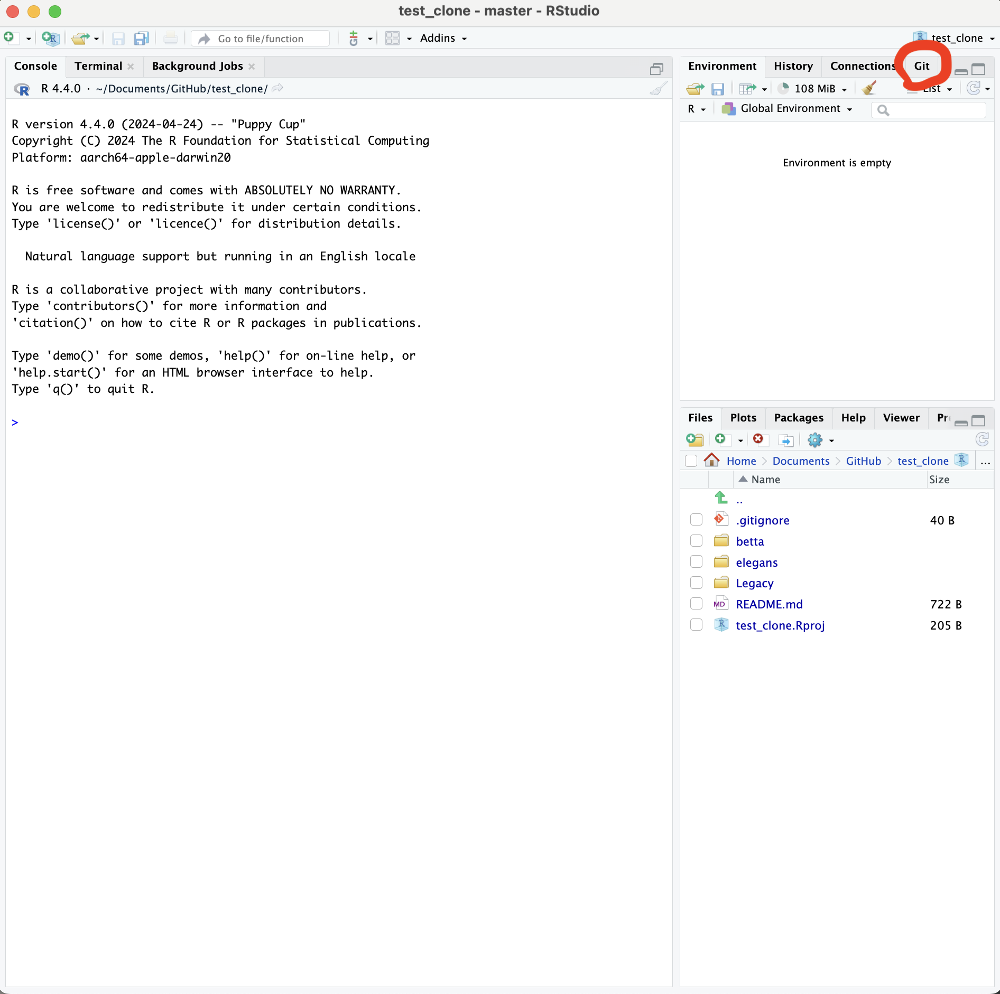 

これでRStudioでGithubのリポジトリのコピーをひらけたことになります。  

### ローカルでファイルを変更してコミットしてプッシュする。  
#### README.mdファイルの作成
それでは実際にファイルを作って、バージョン管理してみましょう。  
レポジトリの説明書きであるREADME.mdというファイルを作ってみます。RStudioのfile/text fileでファイルを作成して、適当に書いてみましょう。Markdownに慣れていない方は[Appendix3 Markdown](#appendix3-markdown)を参照してみましょう。
編集を終えたらSaveしたらファイル名を「README.md」に変えましょう。
#### ここからの流れの説明  
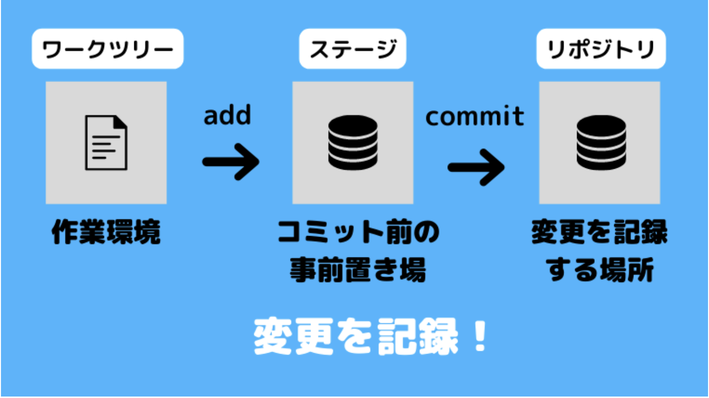   

**ステージにaddしてcommitしてpushする**  
これがファイルを変更したときの基本的な流れです。  
普段皆さんがファイルを編集しているのがワークツリーです。そこから変更したものをステージという一時置き場において、その後コミットという動作でリポジトリに送ります。  

#### 変更点をステージに送る。  
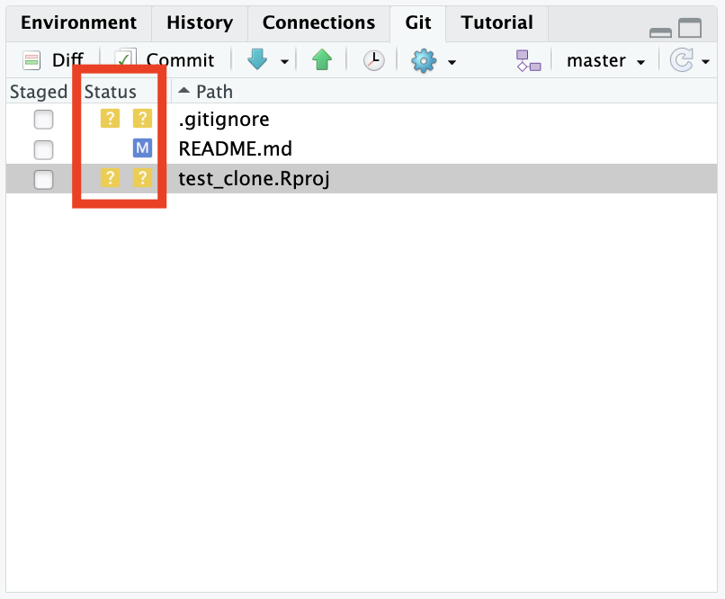  
最初、Git Paneはこんな感じの見た目になっていると思います。列は左から
- stage ステージに送るかどうかのチェックボックス
- status 現在どういう状況か (ボックスが左なら変更がステージに送られている、右なら変更がまだステージに送られていない。両方に黄色のマークは新しく作成されたもの)
- Path ファイルの場所
ステージに送りたいファイルにチェックボックスをつけましょう。  
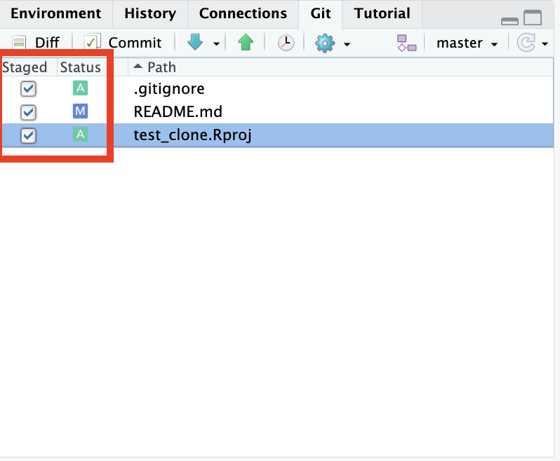  

#### コミットする。  

コミットボタンを押しましょう。  
以下のような画面が出ると思います。  
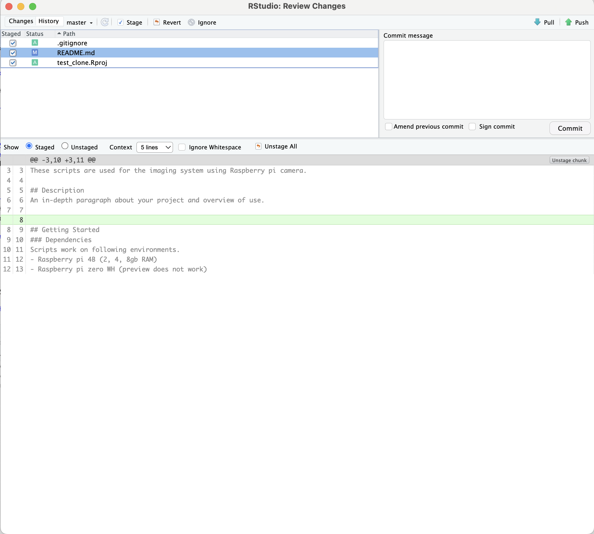  
左上の画面はさっき見たGit paneと似たような画面です。
適当なファイルを選択すると、下の画面が変わることに気づくと思います。下の画面はどんな変更がなされたかが表示されています。赤色は削除された部分、緑色が追加された部分です。

右の画面はCommit messageを書く部分になります。ここはどんな変更を加えたのかを端的に書くと良いでしょう。スタイルとしては
1行目に短いメッセージ、2行目を開けて3行目以降に詳しいメッセージ
みたいにすると良いと思います。

コミットメッセージの例
```
[modify]凡例を追加

ggplotでグラフを書いた際に、自動で凡例をつけるように変更しました。凡例のラベルはデータの列名から取得するようにしています。
```

(1行目はGithubで見るとこんな感じです。)  
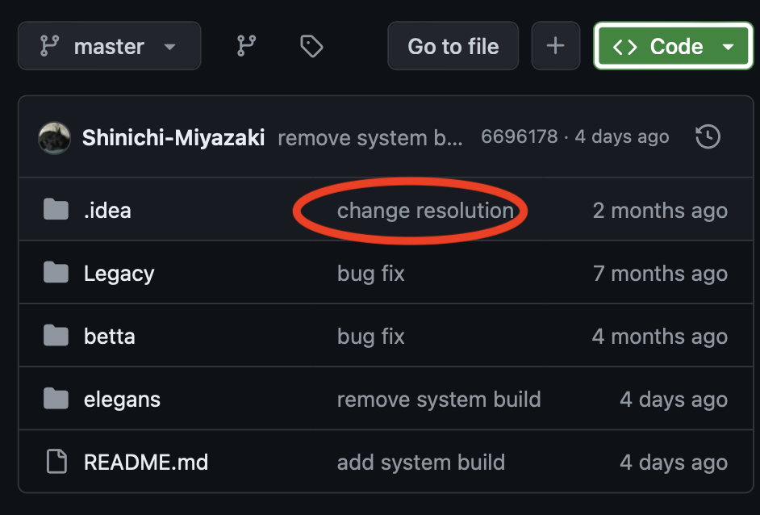  

#### 変更点をプッシュする。  
プッシュボタンを押しましょう。ここは特に他にすることはなくて、ただ押すだけです。  
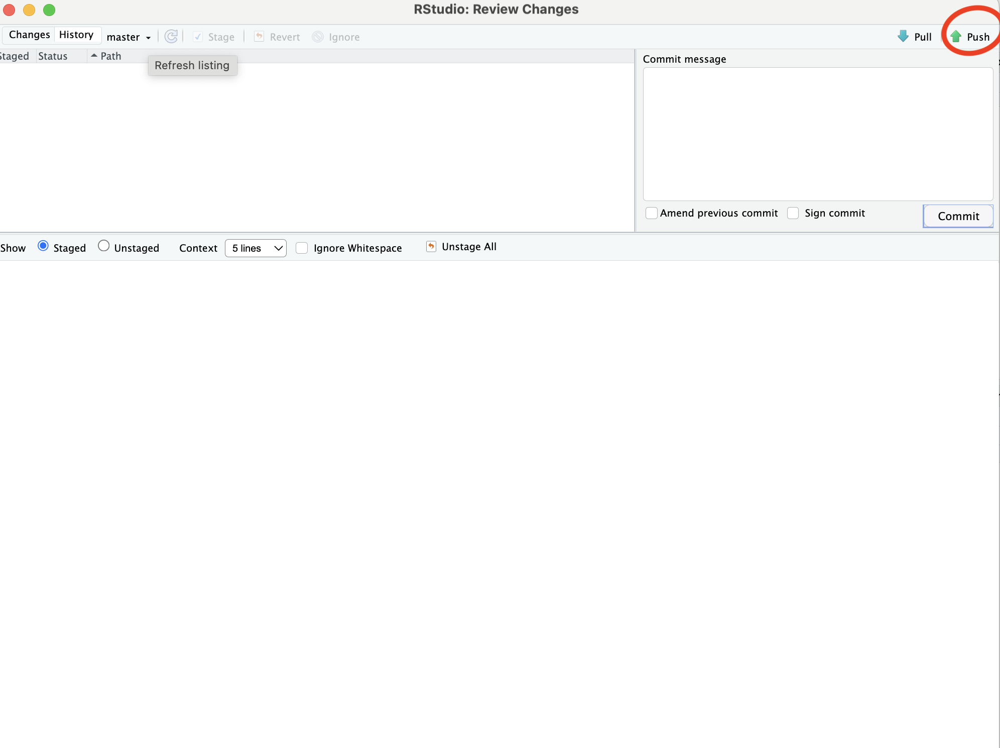   
おすと色々と画面が出現すると思いますが、それは消してしまって大丈夫です。  

Githubで変更が反映されているか見てみましょう。  
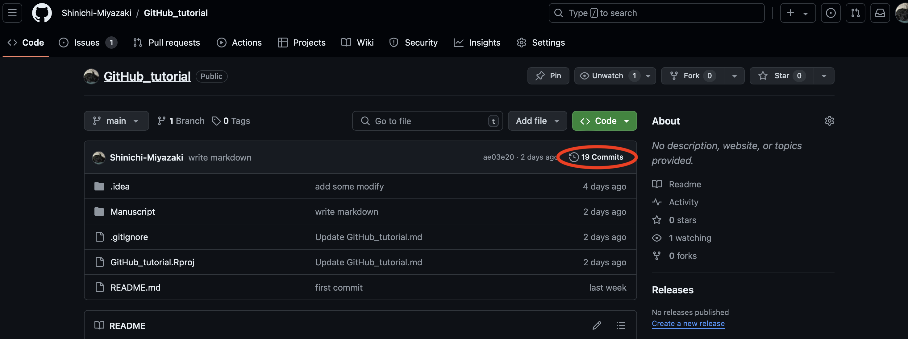  
試しに、右側のcommitという部分を押してみると、これまでのコミットの履歴が出てきます。  
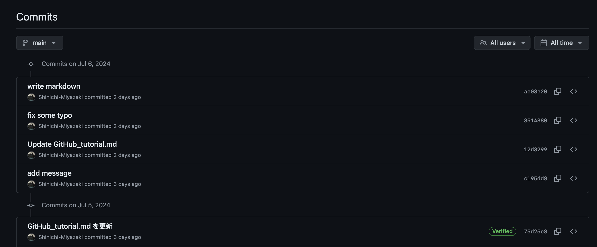   

## §2-2 日常的な作業をしてみる。 (Pull, Commit, Push)  
前の章では初めてレポジトリを作ってそれをローカルにクローンして、ファイルを編集してコミットして、リモートにプッシュしてみました。
次はすでに作ってあるリポジトリを使ってプログラムの更新をしてみましょう。

ここでは私は自分で作ったRCodesというレポジトリのなかのファイルを書き換えて、コミットしてプッシュしてみます。

### まずはプル  
まずはリモートの最新版でローカルのコードを更新します。  
基本的にはローカルに最新版を置いておくのは得策ではなく、１日の作業が終わったらコミット & プッシュをしてリモートを最新版にしておくのが良いと思います。
上記のようにしておけば、作業の開始は常にPullになるわけです。
(ここでpullしないで進めていくと、のちに述べるコンフリクトという状況に陥ったりします。)  

最初にpullをする方法を説明します。
まずはRStudioで編集したいディレクトリ (プロジェクト) を開きます。  
Git paneのところに下向きの緑矢印があると思いますので、そちらを押してもらうと、
"Pull with rebase" という言葉が出てくると思います。 
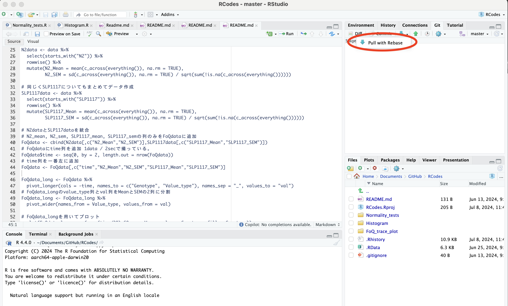   

こちらを押すと、Github上のリモートであなたのPCのローカルを更新してくれます。もしAlready up to dateというふうに出ていたら、ローカルがすでに最新版になっています。

### 次に編集してコミット
それでは最新版になったコードを書き直してみましょう。  
ここはみなさんお好きなコードを書いていけばいいと思うのですが、私はRCodesというリポジトリの正規性の判定をしてくれるコードを書き直したくなったとします。  
最初はこんな感じのコードを、  
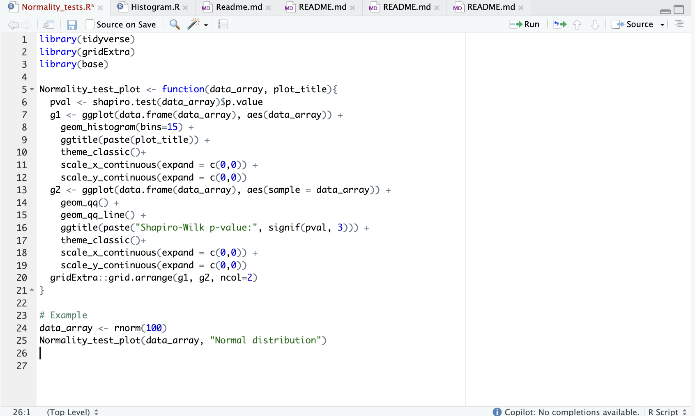   
出来上がるプロットの部分があまり綺麗ではないし、軸のラベルも正しくなかったので、以下のように直してみました。  
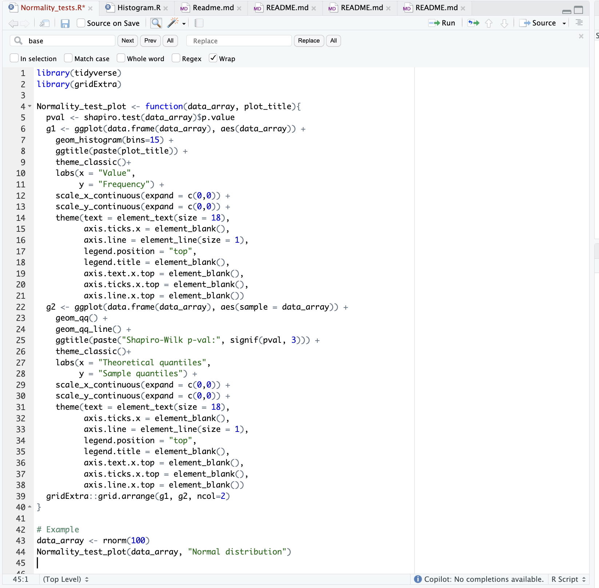   

ファイルを保存すると、右上のGit paneが更新されて、 Normality_test.Rの更新が追跡されていることがわかります。  
あとはチェックボックスをチェックしてステージにあげます。    
   

コミットボタンを押すと  

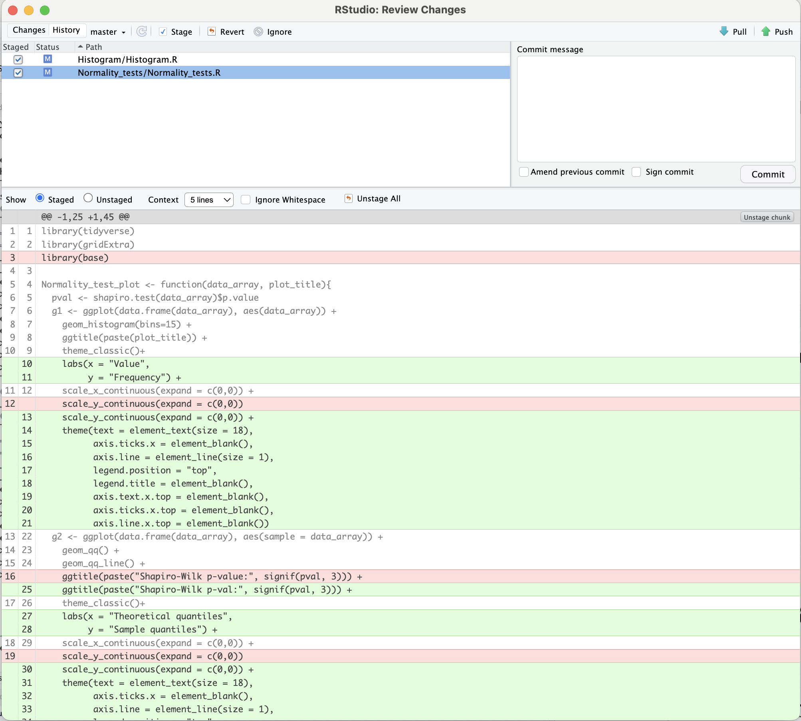      

以上のようにどのような変更がなされたのかを示してくれます。  
ここで適当にコミットメッセージを打ったコミットしましょう。  

### 最後にプッシュ
コミットしただけでは、リモートのリポジトリは更新されていません。忘れずにプッシュしましょう。  
コミットがうまくいっていれば、Git paneに下の赤い四角で囲ったようなメッセージが出ていると思います。これはコミットしたけどリモートに反映されていないものが1塊ありますよ　というような意味です。  
  
赤丸で囲った上矢印がPushのボタンなので、こちらを押しましょう。
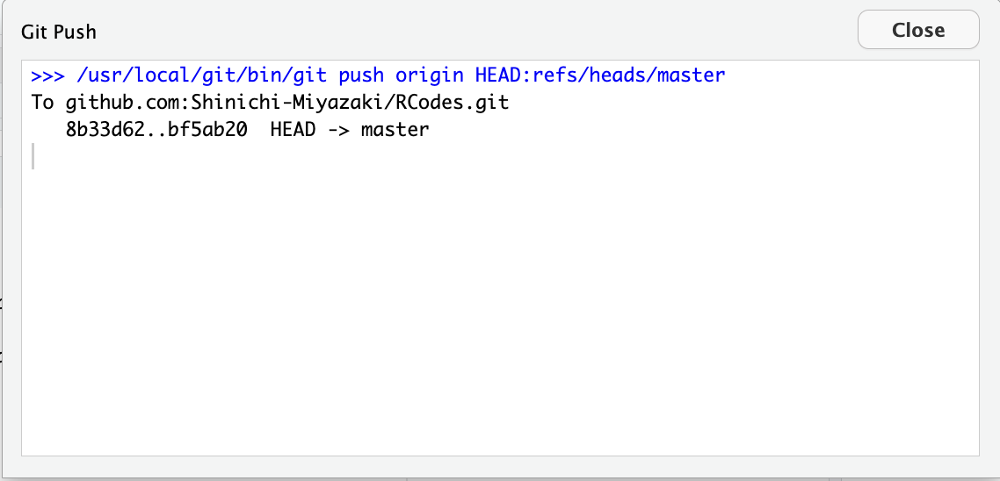 
こんな感じで、出ていればOKです。

お疲れ様です。これでコードを最新版にして、編集して更新という一連の流れができました！。
試しにリモートで、先ほどの変更が保存されているかみてみましょう。
まずはリモートで先ほどのリポジトリに行ってみます。
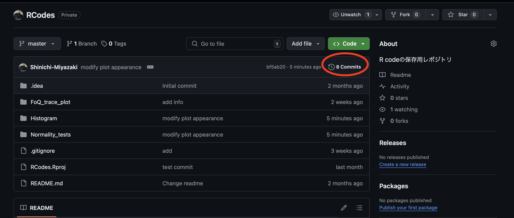 
右の方のCommitを押してみましょう。
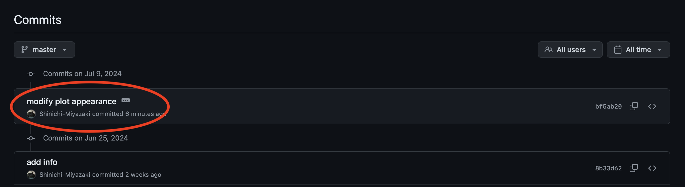 
先ほどのコミットがきちんと記録されています。中身を見てみると
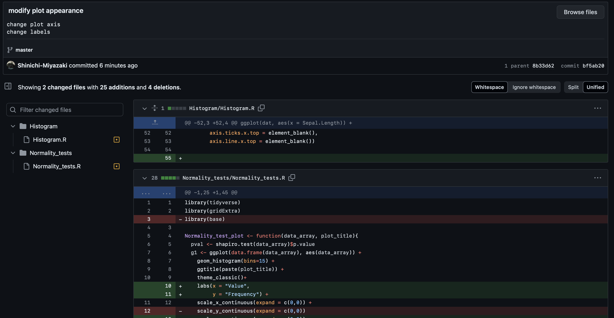 
このようにどのような変更がされたのかをみることができます。

特定のコードでうまく行っていたのに、次の日に少しいじったらうまくいかなくなった　みたいなことが生じたとしても、この機能があればどんな変更を自分が施したのかわかるので解決の糸口になります。
また以前のバージョンに戻すのも簡単にできます。

少しは便利さが伝わるでしょうか?


## §2-3 RStudio特有の問題　.gitignoreによる追跡の除外
ここでは少しRStudioに特有の問題について書いていきます。
RStudioのプロジェクトは大変便利な機能です。特にワーキングディレクトリが固定されているのが大変わかりやすいです。
ただRStudioを普通に使っていてGitHubを導入すると少し困ったことがおこることがあります。

時折みるRStudioのフォルダ構成に以下のような構成があります。
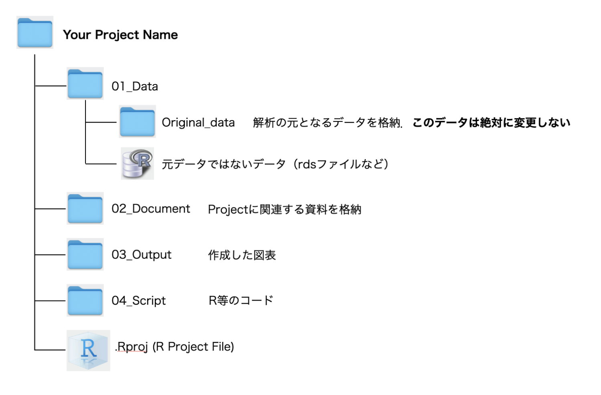 
要するにRProjectのフォルダ内にデータも入れる構成です。
この構成のメリットとして、RProjectは開いた段階でカレントディレクトリがプロジェクトのディレクトリになるので、Dataを相対パスで指定しやすいという点があります。
またデータとRコードを近くに置いておくことで、どちらも迷子にならないという点もメリットです。

一方でプロジェクト自体をGitHubで管理すると以下の2点の問題が起こります。
1. Githubは大きいサイズ (>100MB) のファイルをサポートしていないので、大きい生データだった場合にエラーが起こる。
2. 生データが外部に出る可能性は0.1%でも避けたいので、とにかくアップロードしたくない。

これを避けるためには、Gitに対して「このファイルは追跡しないでくださいね」というのを教える必要があります。
それが.gitignoreです。

.gitignoreはリポジトリを作成する際に一緒に作成するかどうか聞かれるので、必要だと思ったら次からリポジトリを作る際に設定しておくといいと思います。

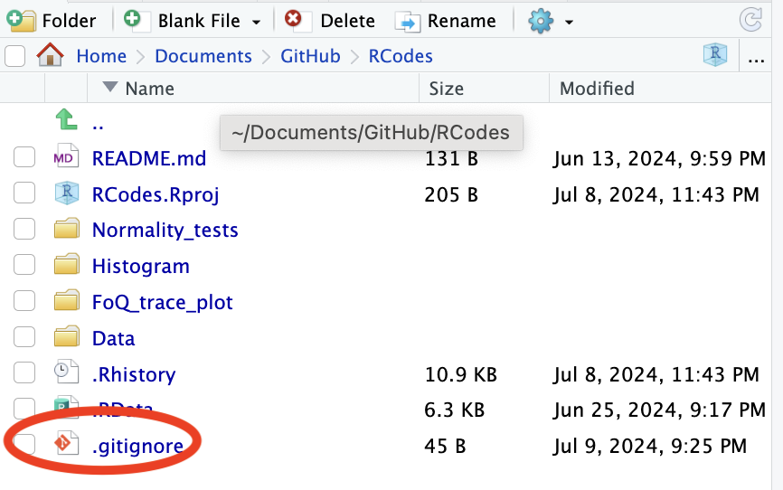 

.gitignoreでgitの追跡から外すディレクトリやファイルを指定するには以下のような方法があります。

1. フォルダとその中身を無視する。
フォルダ名/　と記載します。

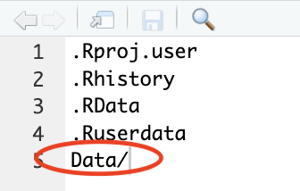 

この例ではData フォルダと内部のファイルを全て無視します。

2. 特定の拡張子を無視する。
例えばcsvファイルをすべて無視する場合には
.csv
と記載します。上記の例では.Rhistoryという履歴ファイルなどが無視されています。

他にもたぶん書き方が色々あるので、必要に応じて調べてみてください。

さて今回私はDataフォルダ内にtest.mdというファイルを作ってみました。通常であればGit pane内に変更履歴が出ているはずです。

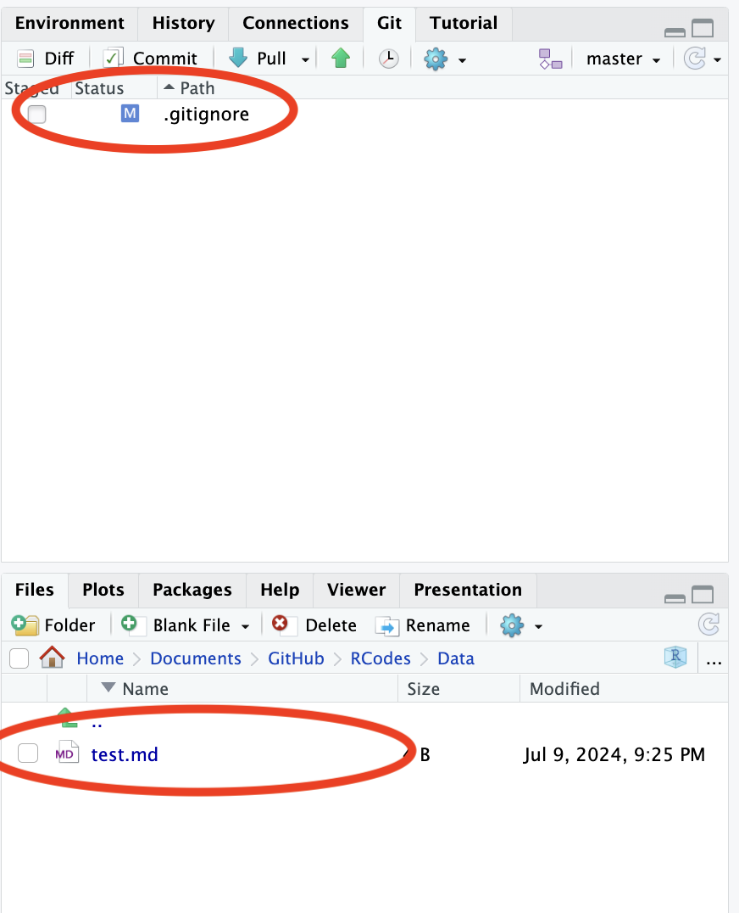 
上記の通り、下のファイルPaneではtest.mdが現れていますが、Git Paneではtest.mdが現れていないのがわかります。

うまくDataディレクトリの内部を追跡しないようにできています。

みなさんも.gitignoreをうまく使って、安全にコードやファイルの変更履歴を追跡しましょう！

## §2-4 初めてのブランチ 家とラボの両方でコードを書く   
 
## §2-5 コンフリクトに対応してみる。  


<div style="page-break-before:always"></div>

## §2-5 VSCodeをGitHubと連携してみる。


<div style="page-break-before:always"></div>

# §3 共同開発編
## §3-1

<div style="page-break-before:always"></div>


# Appendix1 パスとディレクトリ  
## パスとディレクトリ  

多分間違っていますが、住所に例えてみます。住所は
日本/茨城/つくば/天王台/1-1-1　
みたいに階層構造になっています。日本は茨城を含んでいて、茨城はつくばを含んでいます。
こうした時に、パスは住所全体でディレクトリは「日本」とか「つくば」とかの階層の名前を指していると考えると良いかもしれません。

例えば私のPCのデスクトップのパス (住所) をみてみると
```
/Users/miyazakishinichi/Desktop
```
だそうです[^3]。

[^3]: windowsの人は違う感じになると思います。Windowsの人はパスをコピーした際の区切り文字が¥か\なので気をつけてください。僕は/で統一したいのでPathcopycopyと言うソフトを入れて/で区切るパスもコピーできるようにしています。

パスはファイルにも定義できて、デスクトップ上にあるtest1.csvというファイルのパスであれば
```
/Users/miyazakishinichi/Desktop/test1.csv
```
となります。

ディレクトリはさっきの例で言うと、
Users
miyazakishinichi
Desktop
が該当します。test.csvはファイルを内包できないのでディレクトリではないです。  

## 絶対パスと相対パス
パスには実は2種類あって、絶対パスと相対パスがあります。
絶対パスは上記したように一番上のディレクトリ (**ルートディレクトリ　といい"/"で表します。**) から順に書いていく方法で、普通の住所のような感じです。これのメリットは、自分が今どこにいようが書き方が変わらない点です。自分がニューヨークにいようが土佐にいようが筑波大学の住所は上記のままです。
相対パスは**今自分がいる場所 (カレントディレクトリと言います) から目的のところまでの行き方を書いた**パスです。

パスの書き方では
- . (カレントディレクトリ)
- .. (一つ上の階層のディレクトリ)
を示しています。
今こんな感じのフォルダ構成になっているとしましょう。
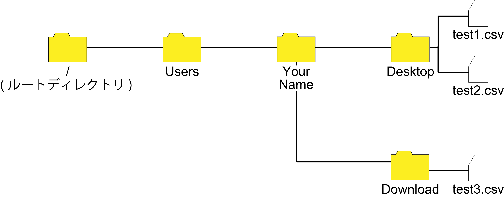     
そして今あなたがDesktopディレクトリにいる[^4]とします。この時にtest1.csvの相対パスはどうなるかというと
```
./test1.csv
```
となります。"."はカレントディレクトリ (=Desktop) を示すので、その下のtest1.csvだけ指定してあげれば住所としては十分なわけです。

すなわちtest1.csvのパスは2種類あって
```
/Users/miyazakishinichi/Desktop/test1.csv (絶対パス)
./test1.csv (Desktopにいるときの相対パス)
```
となります。

ここまで読んでお気づきの方もいると思いますが、上記の例だけでは、今いるディレクトリ以下のファイルしか、相対パスでは指定できない　と思うかもしれません。そこで出てくるのが".." (一つ上の階層のディレクトリ) です。

例えば今Desktopにいるとして、test3.csvの相対パスを指定したい時には以下のように書きます。
```
../Download/test3.csv
```
最初の ".." が "一つ上の階層のディレクトリ" と言う意味なので、Desktopの上の階層であるYournameを指定しています。YournameはDownloadとDesktopを含んでいるので、そのうちのDownloadを指定してあげて、その中のtest3.csvを指定する　と言うのが上記の意味になります。

[^4]:「いる」って何だよと思った方は鋭いですが、後で説明するので待っててください。


## 「いる」とは何か
大体のコンピュータ作業において、「今自分がどこにいるか」と言うのは大事です。普段はあまり意識しないかもしれませんが、gitを使ったりR, pythonを使っていくなら知っておいたほうがいいと思います。

今どこにいるか　はいくつかの方法で知ることができます。  
ターミナルやGitBashでは以下のコマンドです。
```
pwd
```

RStudioを使っているならコンソールで以下を打ってみましょう。
```R
getwd()
```

PythonではIDEのコンソールで以下を打ってみましょう。
```Python
import os 
os.getcwd()
```

これで「今どこにいるか」がわかるようになりました。
この「今どこにいるか」をカレントディレクトリ　と言います。

## ホームディレクトリとルートディレクトリ
もう一つの概念としてホームディレクトリがあります、これはエディタなどを開いた際に最初に「いる」ディレクトリのことです。例えばターミナル (GitBash) を新しく開くと以下のような画面が出ると思います。  

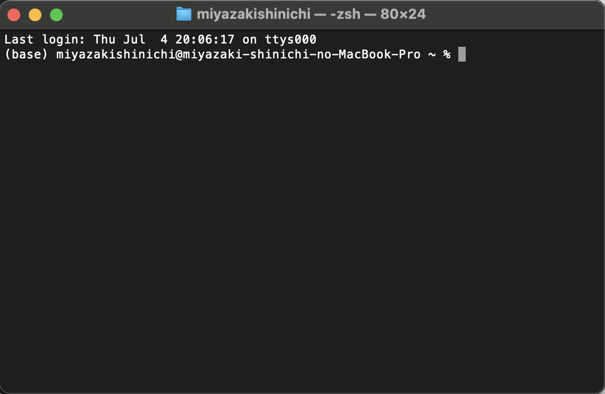  

この状態で今いる場所を尋ねると  

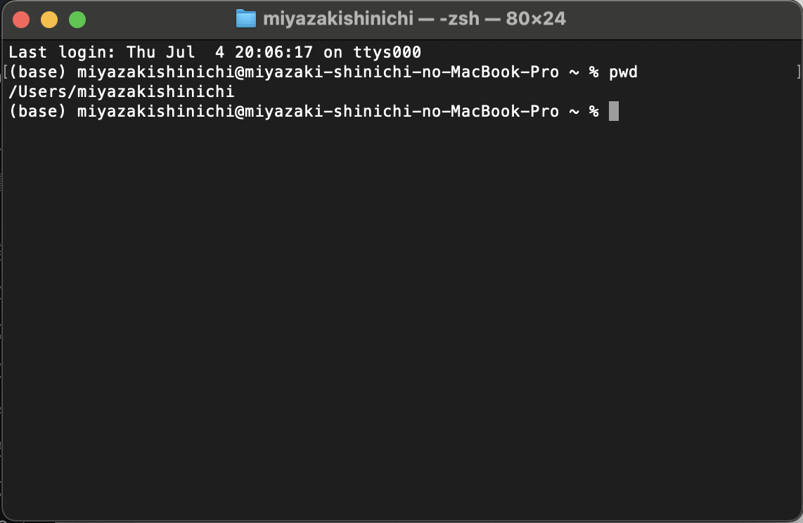    

このようにUsers/miyazakishinichiにいますよ　と答えてくれます。この最初に開いた場所をホームディレクトリ　と言います。またパスの書き方ではホームディレクトリを"~"で表します。
ですので例えばホームディレクトリの下にDesktopがあるなら
```
~/Desktop
```
でデスクトップのパスを表すことができます。

もう一つの概念としてルートディレクトリがあります。これはパソコン内で最も上位に位置する階層のことです。パスの書き方では"/"で表します。
これが便利なのはディレクトリ移動の時です。ディレクトリ移動はターミナルやGItBashで
```Bash
cd （行きたいパス) 
``` 
と書きます。
それでは練習として、
1. ターミナルを開き
2. デスクトップに移動する
```bash
cd /Users/Yourname/Desktop
```
3. デスクトップからDownloadフォルダ内のどこかのフォルダに移動してみる。
```bash
cd ../Download/testDir
```
4. ルートディレクトリに戻る。
```bash
cd /
```
5. もう一度デスクトップに移動
```bash
cd /Users/Yourname/Desktop
```
6. ホームディレクトリに戻る。
```bash
cd ~
```

できましたでしょうか？ホームディレクトリがルートディレクトリの人は多分同じ場所に戻ると思います。  

# Appendix2 そもそもGitとGithubとは？  

(最初に読むには難しいので飛ばして良いです)  
Gitは、ソフトウェア開発におけるバージョン管理システムの一つで、プロジェクトのソースコードの変更履歴を管理するために使用されます。
GitHubは、Gitのリポジトリをホスティングするウェブベースのサービスです。プロジェクトのコラボレーションとコード共有に特化しており、開発者がプロジェクトを公開または非公開で管理できるプラットフォームを提供します。GitHubは、プルリクエストやイシュートラッキングなどの機能を通じて、チーム内のコミュニケーションとコードレビューのプロセスを簡素化します。

GitとGitHubの組み合わせは、ソフトウェア開発プロジェクトの効率的な管理と協力を可能にします。Gitがバージョン管理と分散作業のサポートを提供する一方で、GitHubはこれらのプロセスをよりアクセスしやすく、より協力的なものにします。

GitやGitHubを使用することで、このプロセスが大幅に簡単になります。これらのツールを使うことで、以下のような利点があります：

1. **変更履歴の全記録**：過去のあらゆるバージョンから特定の変更点を簡単に確認できます。
2. **チームでの協力**：複数人で同じプロジェクトに取り組む際に、互いの作業を上書きすることなく、効率的に作業を進めることができます。
3. **ブランチ機能**：新機能の開発やバグ修正をメインのプロジェクトから分離して作業することができ、安定したバージョンを保ちながら開発を進めることが可能です。
4. **マージ機能**：異なるブランチの変更を統合することができ、スムーズにプロジェクトを一つにまとめることができます。
5. **レビュープロセス**：GitHubのプルリクエスト機能を使用することで、コードの変更を他の人がレビューし、フィードバックを提供する前にマージすることができます。

これらの機能により、個人でもチームでも、より効率的に、より安全にプロジェクトを進めることができます。GitとGitHubは、現代のソフトウェア開発において不可欠なツールとなっています。


# Appendix3 Markdown　　

Markdownは、プレーンテキストで記述した文書をHTMLに変換できる軽量マークアップ言語です。

特徴

シンプルで読みやすい
記述が簡単
HTMLよりも直感的に記述できる
様々なプラットフォームで利用可能
用途

ブログ記事
READMEファイル
チートシート
資料作成
コミュニケーションツール
## 基本的な記法

### 見出し

```Markdown
# これは1つ目の見出し
## これは2つ目の見出し
### これは3つ目の見出し
```

### 太字

``` Markdown
**太字**
```

### 斜体

```Markdown
* 斜体*
```

### 箇条書き

```Markdown
* 箇条書き1
* 箇条書き2
* 箇条書き3
```

### 番号付きリスト

```Markdown
1. 番号付きリスト1
2. 番号付きリスト2
3. 番号付きリスト3
```

### リンク

```Markdown
[リンクテキスト](https://www.example.com)
```

### 画像

```

```

## Markdownのメリット

シンプルで読みやすい
Markdownは、プレーンテキストベースなので、シンプルで読みやすいのが特徴です。HTMLと比べて記述量も少なく、初心者でも簡単に習得することができます。

記述が簡単
Markdownは、装飾記号と呼ばれる記号を使って文章を装飾します。装飾記号は直感的に理解できるものが多いので、記述が簡単です。

HTMLよりも直感的に記述できる
Markdownは、HTMLよりも直感的に記述できるのが特徴です。HTMLでは、タグを使って文章を装飾する必要がありますが、Markdownでは装飾記号を使って装飾するので、タグを覚える必要がありません。

様々なプラットフォームで利用可能
Markdownは、様々なプラットフォームで利用可能です。ブログサービス、Wiki、エディタなど、多くのツールでMarkdownに対応しています。

## Markdownのデメリット

表現力が制限される
Markdownは、HTMLと比べて表現力が制限されます。複雑なレイアウトや装飾には、HTMLの方が適しています。

プレビュー機能がないエディタもある
Markdownエディタの中には、プレビュー機能がないものがあります。プレビュー機能がないと、記述内容を確認しながら作業することができません。

## まとめ

Markdownは、シンプルで読みやすく、記述が簡単な軽量マークアップ言語です。ブログ記事やREADMEファイル、チートシートなど、様々な用途に利用することができます。

Markdownを習得することで、文章をより効果的に表現することができます。ぜひ、Markdownを活用してみてください。

